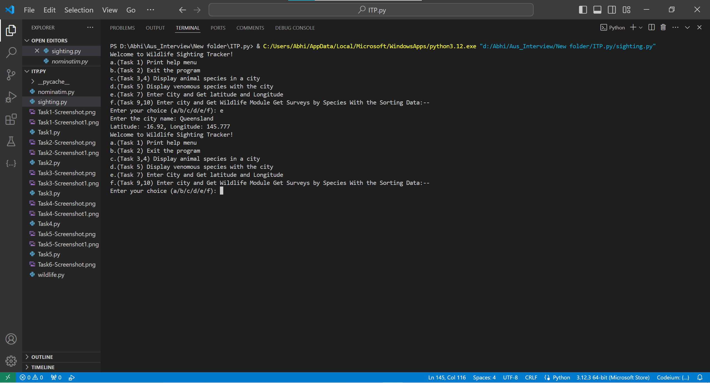
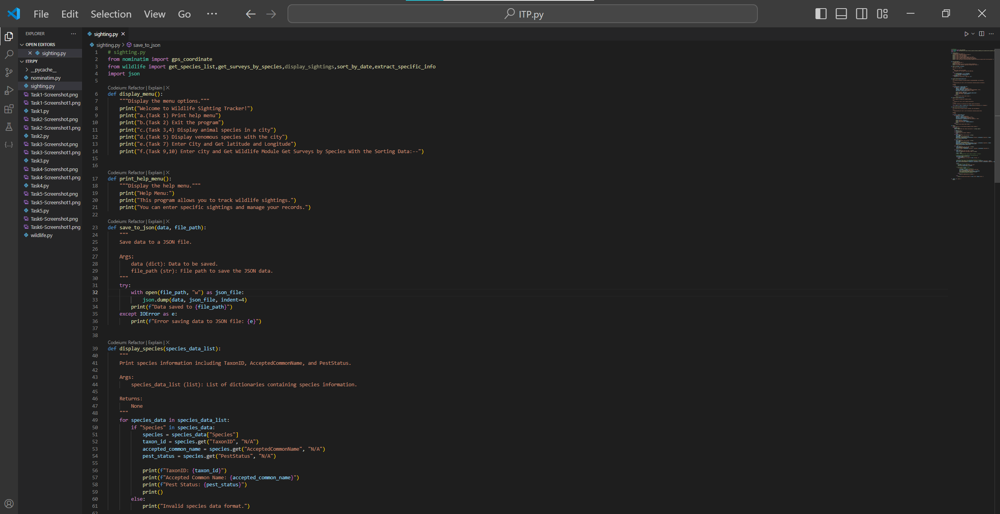
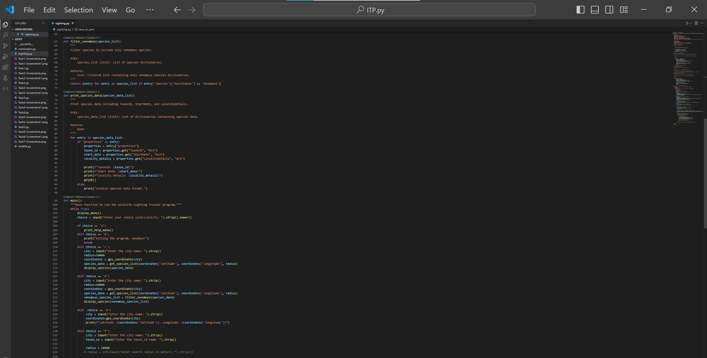
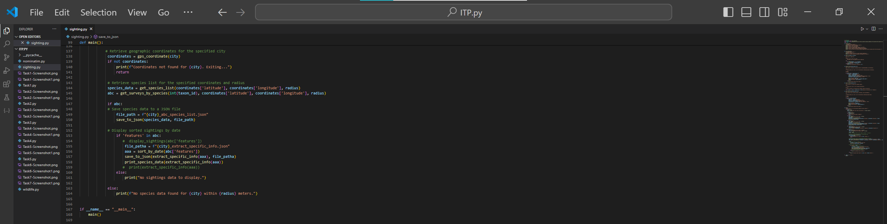
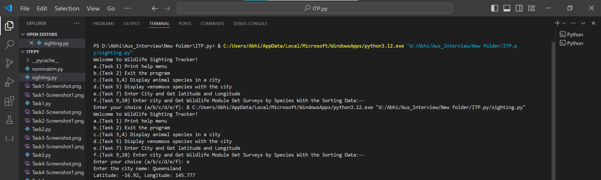
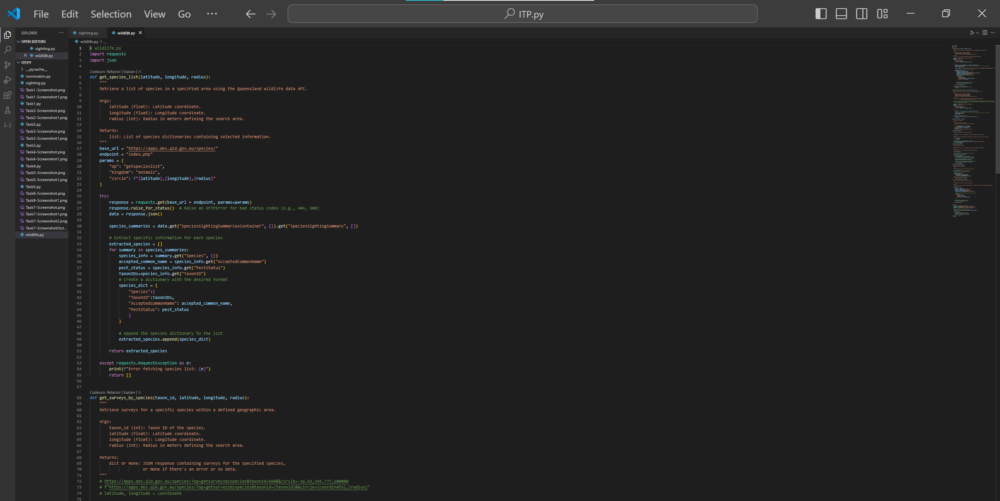
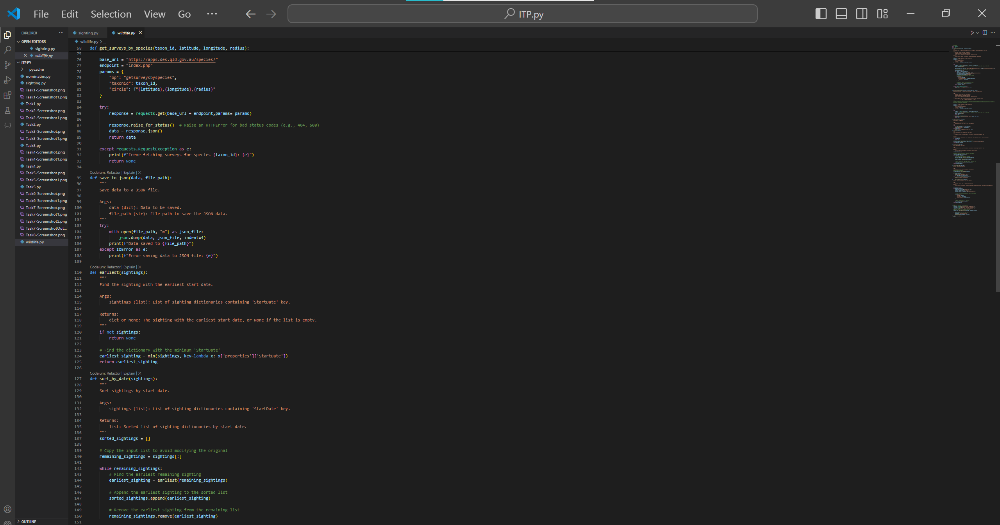
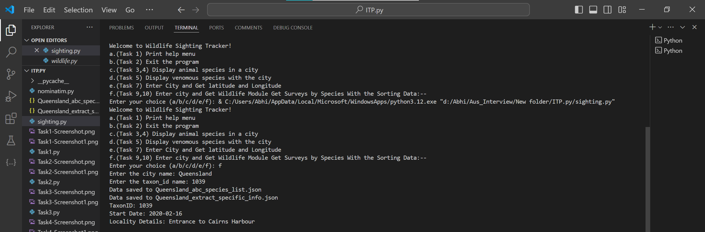

# WEEK 9

**Task 6 Add a GPS stub**

**Code:**

**Output:**

**Task 7 GPS Webservice Module**

**Code:**

**Code:**

**Code:**

**Output:**

**Task 8 Wildlife Module Get Species List**

**Code:**

**Code:**

**Code:**

**Output:**

